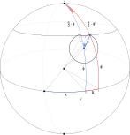

# Izris krožnice na zemljevidu

Predposatvimo, da je zemlja krogla.

Podano imamo središče krožnice $B = (\phi, \lambda)$, latituda in longituda, in polmer $c$.
Izračunati moramo točke na krožnici $A = (\phi', \lambda')$ za kote $\beta = 0, k, ..., 2\pi$, kjer je $k$ želena natančnost.

V geometriji na krogli kote in *razdalje* merimo v radianih.
Razdalja med dvema točkama je kot loka skozi ti dve točki.
Torej, če imamo polmer krožnice $c$ podan v kilometrih $d$, ga pretvorimo v radiane $c = \frac{d}{R}$, kjer je $R = 6371$ polmer zemlje.

$A$ izračunamo z uporabo naslednjih enačb:

$$
\begin{aligned}
\phi' &= \arcsin(\sin{\phi} \cos{c} + \cos{\phi} \sin{c} \cos{\beta})\\
\Delta &= \arctan\left(\frac{\sin{\beta} \sin{c} \cos{\phi}}{\cos{c} - \sin{\phi} \sin{\phi'}}\right)\\
\lambda' &= \lambda + \Delta
\end{aligned}
$$

Za izračun $\arctan(y / x)$ uporabimo funkcijo [atan2](https://en.wikipedia.org/wiki/Atan2). Ta zagotovi, da je $\Delta$ za $\pi < \beta < 2\pi$ negativen.
Drugače bomo izrisali le polovico krožnice.

Krožnica na zeljevidu zaradi projekcje vedno ne bo okrogla.

## Izpeljava



Izpeljava temelji na trikotnikih na krogli.
Potrebovali bomo [kosinusni izrek za stranice](https://en.wikipedia.org/wiki/Spherical_trigonometry#Cosine_rules_and_sine_rules) in eno izmed [Napierjevih enačb](https://en.wikipedia.org/wiki/Spherical_trigonometry#Napier's_rules_for_right_spherical_triangles).
Slednjo lahko uporabimo le, če je imamo pravokotni trikotnik.

$$
\begin{aligned}
\cos{c} &= \cos{a} \cos{b} + \sin{a} \sin{b} \cos{\gamma}\\
\cos{\gamma} &= \frac{\cos{c} - \cos{a} \cos{b}}{\sin{a} \sin{b}}
\end{aligned}
$$

$$
\begin{aligned}
\sin{a} &= \sin{\alpha} \sin{c}\\
\sin{\alpha} &= \frac{\sin{a}}{\sin{c}}
\end{aligned}
$$

Prav tako bomo uporabili enakosti:

$$
\begin{aligned}
\sin(\pi / 2 - \theta) &= \cos(\theta)\\
\cos(\pi / 2 - \theta) &= \sin(\theta)
\end{aligned}
$$

### Latituda

Skozi severni pol $N$ in točko $B$ poteka poldnevnik.
Razdalja med $B$ in presečiščem poldnevnika in ekvatorja $D$ je latituda $\phi$, razdalja med severnim polom $N$ in $B$ je $\frac{\pi}{2} - \phi$.
Podobno velja za $A$.

Za izračun $\phi'$ uporabimo kosinusni izrek nad trikotnikom $BNA$. Dolžina stranice $NB$ je $\frac{\pi}{2} - \phi$, dolžina stranice $BA$ je $c$, vmesni kot je $\beta$, izračunamo dolžino stranice $NA$:

$$
\begin{aligned}
\cos(\pi / 2 - \phi') &= \cos(\pi / 2 - \phi) \cos{c} + \sin(\pi / 2 - \phi) \sin{c} \cos{\beta}\\
\sin{\phi'} &= \sin{\phi} \cos{c} + \cos{\phi} \sin{c} \cos{\beta}\\
\phi' &= \arcsin(\sin{\phi} \cos{c} + \cos{\phi} \sin{c} \cos{\beta})
\end{aligned}
$$

### Longituda

Za izračun dolžine $\Delta$ bomo uporabili Napierjevo enačbo nad trikotnikom $DNE$:

$$
\begin{aligned}
\sin{\Delta} &= \sin{\nu} \sin(\pi / 2)\\
\sin{\Delta} &= \sin{\nu}\\
\Delta &= \nu
\end{aligned}
$$

Ker je $\sin(\pi/2) = 1$ sta dolžina $\Delta$ in kot $\nu$ enaka.
Torej, lahko namesto $\Delta$ izračunamo $\nu$.

Uporabimo preoblikovan kosinusni izrek nad trikotnikom $BNA$. Sedaj imamo vse dolžine stranic in iščemo $\cos{\nu}$:

$$
\begin{aligned}
\cos{\nu} &= \frac{\cos{c} - \cos(\pi / 2 - \phi) \cos(\pi / 2 - \phi')}{\sin(\pi / 2 - \phi) \sin(\pi / 2 - \phi')}\\
\cos{\nu} &= \frac{\cos{c} - \sin{\phi} \sin{\phi'}}{\cos{\phi} \cos{\phi'}}\\
\end{aligned}
$$

Uporabimo Napierjevo enačbo nad trikotnikom $BCA$:

$$
\sin{b} = \sin{\beta} \sin{c}
$$

Uporabimo preoblikovano Napierjevo enačbo nad trikotnikom $CNA$, vstavimo enačbo za $\sin{b}$, iščemo $\sin{\nu}$:

$$
\begin{aligned}
\sin{\nu} &= \frac{\sin{b}}{\sin(\pi / 2 - \phi')}\\
\sin{\nu} &= \frac{\sin{b}}{\cos{\phi'}}\\
\sin{\nu} &= \frac{\sin{\beta} \sin{c}}{\cos{\phi'}}\\
\end{aligned}
$$

Uporabimo povezavo med $\sin$, $\cos$ in $\tan$ in vstavimo $\cos{\nu}$ in $\sin{\nu}$:

$$
\begin{aligned}
\tan{\nu} &= \frac{\sin{\nu}}{\cos{\nu}}\\
\tan{\nu} &= \frac{\frac{\sin{\beta} \sin{c}}{\cos{\phi'}}}{\frac{\cos{c} - \sin{\phi} \sin{\phi'}}{\cos{\phi} \cos{\phi'}}}\\
\tan{\nu} &= \frac{\sin{\beta} \sin{c} \cos{\phi} \cancel{\cos{\phi'}}}{\cancel{\cos{\phi'}} \cdot {\cos{d} - \sin{\phi} \sin{\phi'}}}\\
\tan{\nu} &= \frac{\sin{\beta} \sin{c} \cos{\phi}}{\cos{c} - \sin{\phi} \sin{\phi'}}\\
\nu &= \arctan\left(\frac{\sin{\beta} \sin{c} \cos{\phi}}{\cos{c} - \sin{\phi} \sin{\phi'}}\right)
\end{aligned}
$$

### Alternativa

$\nu$ lahko izračunamo tudi na naslednja načina:

$$
\begin{aligned}
\nu &= \arccos\left(\frac{\cos{c} - \sin{\phi} \sin{\phi'}}{\cos{\phi} \cos{\phi'}}\right)\\
\nu &= \arcsin\left(\frac{\sin{\beta} \sin{c}}{\cos{\phi'}}\right)
\end{aligned}
$$

Pri tem moramo paziti, da je lahko zaradi računske napake izračunan $\cos{\nu}$ in $\sin{\nu}$ večji od 1 ali manjši od -1.
Torej moramo vednost pred izračunom $\arccos$ ali $\arcsin$ omejiti na ta razpon.
$\Delta$ je potem enak $\nu$ če je $0 < \beta < \pi$ in $-\nu$ če je $\pi < \beta < 2\pi$.

## Koda

```python
import math

r = 6371
c = 100 / r

lat = math.radians(46.554650)
lon = math.radians(15.645881)

#lat = math.radians(-20.567403405075297)
#lon = math.radians(18.93531476081361)

#lat = math.radians(74.32052299860749)
#lon = math.radians(-41.385320553719595)

for i in range(0, 360, 10):
    beta = math.radians(i)
    lat_ = math.asin(math.sin(lat) * math.cos(c) + math.cos(lat) * math.sin(c) * math.cos(beta))

    lon_ = lon + math.atan2(math.sin(beta) * math.sin(c) * math.cos(lat), math.cos(c) - math.sin(lat) * math.sin(lat_))

    print(f"[{math.degrees(lon_)}, {math.degrees(lat_)}],")
```
