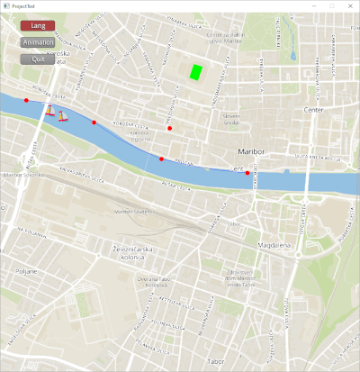

## Implementacija jezika

Implementirajte leksikalni in sintaktični analizator na osnovi BNF notacije, ki ste jo definirali pri načrtovanju jezika za opis infrastrukture mesta. Med razpoznavanjem zgradite abstraktno sintaktično drevo.

Za lažjo predstavo in izris, transformirajte abstraktno sintaktično drevo v tekstovni format GeoJSON, ki ga lahko uvozite v orodje [geojson.io](https://geojson.io). Opis formata lahko najdete na [Wikipediji](https://en.m.wikipedia.org/wiki/GeoJSON).

V naslednjem letu boste pri predmetu *Razvoj računalniških iger* abstraktno sintaktično drevo izrisali na zemljevid:

Nalogo implementirate v poljubnem programskem jeziku, ki ima podporo za JVM. Torej Kotlin, Java, Scala, itd.

### Dodatna navodila

- [Izris krožnice](http://ppj.lpm.feri.um.si/tasks/circle.html)
- [Bezier](https://gist.github.com/brokenpylons/a055457075a5b34866e4ad1a5a56c0df)
- [Funkcije](https://gist.github.com/brokenpylons/3d4dacd1521b99e8d5a3070a5f5911a5)
- [Tipi](https://gist.github.com/brokenpylons/2cd318d101223abf97b17544335c2ab6)
